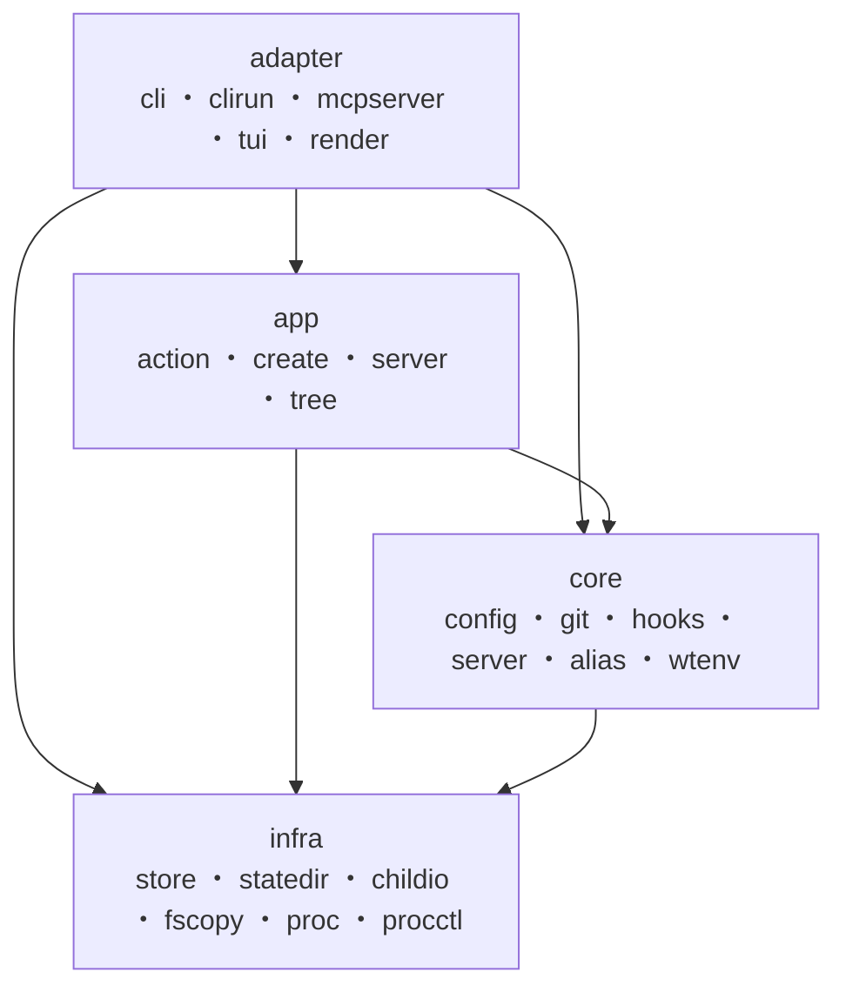

# ディレクトリ構成・設計

Go の標準的なレイアウト（`cmd/` + `internal/`）に従い、責務ごとにパッケージを分割
しています。

`internal/` 配下はレイヤーでグルーピングしています。外部インターフェースの
**adapter**、ワークフローを束ねる **app**、ドメインの **core**、技術的な横断
プリミティブの **infra** に分け、サブシステム固有の関心事は所有するパッケージの下へ
さらにネストします（例: `core/git/worktree`）。層の順位は
`infra < core < app < adapter` で、上位の層は下位の任意の層（隣接に限らず、レイヤを
スキップしてもよい）を import できますが、逆方向は禁止です。この一方向性は
`internal/layering` の import 検査テストが走査して強制し、違反は CI で失敗します。



```
cmd/worktree-integrator/   エントリポイント。Parse → app 構築 → clirun / MCP への振り分けと終了コードの写像
internal/
  ── adapter（外部インターフェース）──
  adapter/
    cli/        コマンドライン解析（cobra）と対話的なリポジトリ選択
    clirun/     CLI の Invocation を app へ振り分け、返った Result を render で描画
    mcpserver/  MCP サーバー（stdio）。ツール定義と app への橋渡し
    tui/        ターミナル UI（Bubble Tea）。ログ閲覧・状態監視・worktree 切り替え
    render/     ユーザー向け整形（進捗・サマリ・表・JSON）
  ── app（アプリケーション層）──
  app/          全ワークフロー共通の依存を束ね、型付きメソッドで各ワークフローを駆動。別名操作と repo 一覧も持つ
    action/     解決済みコマンドの語彙と、フロントエンド入力からの解決。CLI / MCP / TUI が共有
    create/     worktree 作成ワークフロー（探索 → 選択 → 並列作成 → コピー → フック）
    server/     サーバーライフサイクルのワークフロー（switch / status / stop / logs）
    tree/       worktree ライフサイクルの残り（list / enter / remove / doctor）
  buildinfo/    バージョン文字列の解決
  ── core（ドメイン）──
  core/
    alias/      worktree 表示別名のストア（`server status` / `list` の ALIAS 列）
    cmdspec/    設定上のコマンド（文字列 or 配列）→ sh -c スクリプトへの共有プリミティブ
    config/     設定ファイル（スキーマ v2）の読み込みと検証
    git/        ローカル git コマンドの薄いラッパー（fetch / worktree add・prune / ls-files など）
      repo/       repos_dir 配下の Git リポジトリ検出
      worktree/   1 リポジトリ分の処理（fetch → worktree 作成）と並列実行・進捗
    hooks/      フック定義・結果型と、タイミング単位の並列実行
    inventory/  worktrees_dir の実体スキャン（list / doctor / create / remove が共有）
    server/     サーバー設定スキーマ・プロセス制御インターフェースと状態機械・切替 / 停止 / 状態ロジック
      serverfake/ プロセスに触れない ProcessControl のインメモリダブル（テスト専用）
    wtenv/      run / repo コンテキストと WT_* 環境変数のドメイン語彙（唯一の定義）
  ── infra（横断プリミティブ）──
  infra/
    childio/    子プロセスの標準ストリームの接続先（CLI は端末、MCP は stderr / devnull）
    fscopy/     追加ファイルの worktree へのコピー（シンボリックリンク安全）
    proc/       プロセス同一性トークン（Ident）と sh -c 実行の純機構（OS 依存の開始時刻取得）
    procctl/    server のプロセス制御実装。detach 起動とプロセスグループへのシグナル送出
    statedir/   状態ディレクトリ（$XDG_STATE_HOME）のパス解決
    store/      ロック付き・アトミック・バージョン付き TOML 永続化（server 状態と alias が共有）
    testutil/   テスト用のローカル Git リポジトリ生成ヘルパー
```

- `main` は `cli.Parse`（I/O を伴わない純関数）で引数を解決し、設定ファイルと状態ルートを
  1 回だけ読み込んで `app.New` で App を構築し、`adapter/clirun` へ振り分けます（MCP モードは
  `mcpserver` へ直接ルーティング）。dispatch と整形のロジックは `clirun` が担い、`main` に
  残るのは失敗の終了コード（0 / 1 / 130）への写像だけです。対話的な選択処理は `Selector`
  関数型で注入されるため、オーケストレーションを TTY なしで単体テストできます。
- ワークフロー（app 層）は `io.Writer` に直接書かず、途中経過は型付きイベント、最終
  結果は型付き Result として返します。日本語テキスト・JSON への整形は
  `adapter/render` が担います。
- **言語規約**: `core` / `infra` が返すユーザー向けエラー文言は日本語で統一します
  （技術用語 — TOML キー名・フィールド名・パス・下位から `%w` で包んだ os / git の
  出力 — は原文のまま埋め込みます）。列挙化できる状態・進捗表現は言語非依存の列挙型
  （`server` の `SwitchStatus`、`config` の `CheckStatus` など）として返し、その描画は
  `adapter/render` が担います。整形済みテキストの所有者は常に `render` であり、
  `server` / `worktree` サブシステムのように表示層が語彙を持つ経路では、内部の型付き
  エラー（`StepError` などの `Error()`）は表に出ない診断であって描画には使いません。
- 「エラー時も部分結果を見せる」規約は `render.Emit`（`res` が非 nil ならエラーの有無に
  関わらず描画してから `err` を返す）の 1 箇所に集約され、CLI（`clirun`）と MCP
  （`mcpserver`）が同じ実装点を経由するため、ワークフローが部分結果を返し始めても両者で
  挙動が割れません。
- `internal/` 配下は外部から import できないため、公開面は `cmd` の薄いエントリと
  MCP・テストから再利用される `app` のオーケストレーション関数に限られます。

## 実装ノート

各機能ページから参照される、内部動作の詳細です。

- **並列度の自動決定**: worktree の並列作成は fetch（ネットワーク）とディスク I/O が
  主体で CPU バウンドではないため、`-j` 未指定時は
  `min(選択リポジトリ数, CPU コア数 × 4 を 4〜16 にクランプした値)` を上限とします。
  1 リポジトリの失敗は他を止めず、進捗出力は直列化され、結果はリクエスト順に集約
  されます。
- **状態の永続化**: `servers.toml` と `aliases.toml` は共有の `store.File[T]` に
  委譲し、排他アドバイザリロック（flock）＋一時ファイル作成＋ rename でアトミックに
  書き込みます。
- **サーバープロセス**: サーバーは独立セッション（`setsid`）として detach 起動し、
  停止時はプロセスグループ全体へ SIGTERM → SIGKILL をエスカレーションします。ログは
  起動のたびに `.prev` へローテーションします（1 世代保持）。
- **MCP モードの stdio**: JSON-RPC がプロセスの標準入出力を占有するため、フックや
  ライフサイクルコマンドの子プロセスは stdin を `/dev/null`、stdout / stderr を
  標準エラーへ接続します（`infra/childio`）。子プロセスがプロトコルストリーム
  （fd 1）に触れることはありません。
- **キャンセル**: SIGINT / SIGTERM は `context.Context` のキャンセルへ変換され、
  実行中の git・フック・ライフサイクルコマンドまで伝播します（detach 済みの
  サーバー本体は対象外）。exit 130 で終了します。
