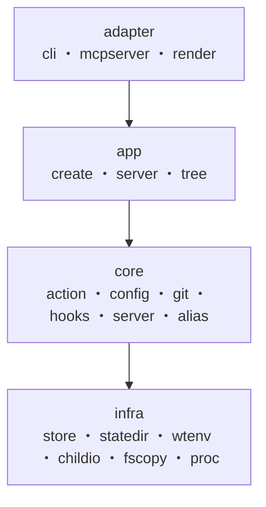

# ディレクトリ構成・設計

Go の標準的なレイアウト（`cmd/` + `internal/`）に従い、責務ごとにパッケージを分割
しています。

`internal/` 配下はレイヤーでグルーピングしています。外部インターフェースの
**adapter**、ワークフローを束ねる **app**、ドメインの **core**、技術的な横断
プリミティブの **infra** に分け、サブシステム固有の関心事は所有するパッケージの下へ
さらにネストします（例: `core/git/worktree`）。依存は `adapter → app → core → infra`
の一方向で、下位の層が上位の層を import することはありません。



```
cmd/worktree-integrator/   エントリポイント。引数解析の振り分けと終了コードの配線のみ
internal/
  ── adapter（外部インターフェース）──
  adapter/
    cli/        コマンドライン解析（cobra）と対話的なリポジトリ選択
    mcpserver/  MCP サーバー（stdio）。ツール定義と app への橋渡し
    render/     ユーザー向け整形（進捗・サマリ・表・JSON）
  ── app（アプリケーション層）──
  app/          解決済みコマンドを各ワークフローへ振り分けるルーター。別名操作と repo 一覧も持つ
    create/     worktree 作成ワークフロー（探索 → 選択 → 並列作成 → コピー → フック）
    server/     サーバーライフサイクルのワークフロー（switch / status / stop / logs）
    tree/       worktree ライフサイクルの残り（list / enter / remove / doctor）
  buildinfo/    バージョン文字列の解決
  ── core（ドメイン）──
  core/
    action/     解決済みコマンド語彙と worktree 名・リポジトリ名の検証。CLI / MCP が共有
    alias/      worktree 表示別名のストア（`server status` / `list` の ALIAS 列）
    cmdspec/    設定上のコマンド（文字列 or 配列）→ sh -c スクリプトへの共有プリミティブ
    config/     設定ファイル（スキーマ v2）の読み込みと検証
    git/        ローカル git コマンドの薄いラッパー（fetch / worktree add・prune / ls-files など）
      repo/       repos_dir 配下の Git リポジトリ検出
      worktree/   1 リポジトリ分の処理（fetch → worktree 作成）と並列実行・進捗
    hooks/      フック定義・結果型と、タイミング単位の並列実行
    inventory/  worktrees_dir の実体スキャン（list / doctor / create / remove が共有）
    server/     サーバー設定スキーマ・プロセス制御・切替 / 停止 / 状態ロジック
  ── infra（横断プリミティブ）──
  infra/
    childio/    子プロセスの標準ストリームの接続先（CLI は端末、MCP は stderr / devnull）
    fscopy/     追加ファイルの worktree へのコピー（シンボリックリンク安全）
    proc/       プロセスグループ操作の OS 依存部（detach 起動・シグナル送出）
    statedir/   状態ディレクトリ（$XDG_STATE_HOME）のパス解決
    store/      ロック付き・アトミック・バージョン付き TOML 永続化（server 状態と alias が共有）
    testutil/   テスト用のローカル Git リポジトリ生成ヘルパー
    wtenv/      run / repo コンテキストと WT_* 環境変数の単一の真実
```

- `main` は引数を `cli.Parse` で解決し、`app`（または MCP サーバー）へ振り分けるだけの
  薄いラッパーです。対話的な選択処理は `Selector` 関数型で注入されるため、
  オーケストレーションを TTY なしで単体テストできます。
- ワークフロー（app 層）は `io.Writer` に直接書かず、途中経過は型付きイベント、最終
  結果は型付き Result として返します。日本語テキスト・JSON への整形は
  `adapter/render` が担います。
- `internal/` 配下は外部から import できないため、公開面は `cmd` の薄いエントリと
  MCP・テストから再利用される `app` のオーケストレーション関数に限られます。

## 実装ノート

各機能ページから参照される、内部動作の詳細です。

- **並列度の自動決定**: worktree の並列作成は fetch（ネットワーク）とディスク I/O が
  主体で CPU バウンドではないため、`-j` 未指定時は
  `min(選択リポジトリ数, CPU コア数 × 4 を 4〜16 にクランプした値)` を上限とします。
  1 リポジトリの失敗は他を止めず、進捗出力は直列化され、結果はリクエスト順に集約
  されます。
- **状態の永続化**: `servers.toml` と `aliases.toml` は共有の `store.File[T]` に
  委譲し、排他アドバイザリロック（flock）＋一時ファイル作成＋ rename でアトミックに
  書き込みます。
- **サーバープロセス**: サーバーは独立セッション（`setsid`）として detach 起動し、
  停止時はプロセスグループ全体へ SIGTERM → SIGKILL をエスカレーションします。ログは
  起動のたびに `.prev` へローテーションします（1 世代保持）。
- **MCP モードの stdio**: JSON-RPC がプロセスの標準入出力を占有するため、フックや
  ライフサイクルコマンドの子プロセスは stdin を `/dev/null`、stdout / stderr を
  標準エラーへ接続します（`infra/childio`）。子プロセスがプロトコルストリーム
  （fd 1）に触れることはありません。
- **キャンセル**: SIGINT / SIGTERM は `context.Context` のキャンセルへ変換され、
  実行中の git・フック・ライフサイクルコマンドまで伝播します（detach 済みの
  サーバー本体は対象外）。exit 130 で終了します。
