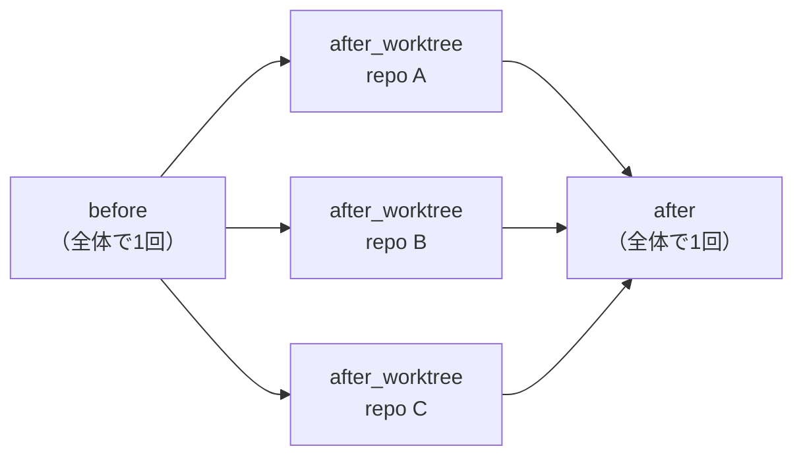

# フック（hooks）

ワークフローの決まったタイミングで任意のシェルコマンド（**フック**）を実行できます。
設定ファイルの `[[hooks.<タイミング>]]` テーブルに記述し、同じタイミングのフックは
すべて並列に実行されます。Jira チケットの確認のような前処理や、作成した worktree への
自動遷移などに使えます。

## タイミング



| タイミング | 実行されるとき | 作業ディレクトリ | 用途の例 |
| --- | --- | --- | --- |
| `before` | リポジトリ探索の前に 1 回 | 呼び出し時のディレクトリ | Jira チケットの確認・事前検証 |
| `after_worktree` | 新規作成された worktree ごとに 1 回 | その worktree | 依存関係のインストール |
| `after` | 全処理の後に 1 回（`wt enter` でも実行） | 呼び出し時のディレクトリ | 通知・worktree への自動遷移 |

`before` フックの失敗は、リポジトリ処理に入る前に全体を中断します。`after_worktree` /
`after` フックの失敗は処理を続行しつつ、最終的な終了コードを非ゼロにします
（いずれも `allow_failure` で警告に格下げできます）。

## フックの項目

| キー | 既定値 | 説明 |
| --- | --- | --- |
| `name` | （必須） | 進捗・サマリ表示に使う名前 |
| `command` | （必須） | `sh -c` で解釈されるコマンド。文字列（パイプや `&&` も可）か、文字列の配列で複数コマンドを指定できます |
| `allow_failure` | `false` | `true` のとき、失敗しても全体を失敗扱いにせず警告にとどめます |
| `workdir` | タイミングごとの既定 | 作業ディレクトリの明示指定 |
| `timeout_secs` | `0`（無制限） | 最大実行時間（秒）。超過すると強制終了され、`allow_failure` に従って失敗または警告として報告されます |

`command` に配列を渡すと、各コマンドを記述順に逐次実行します（内部的に `&&` で連結）。
途中で失敗するとそこで打ち切られます。

!!! note "常駐プロセスはフックではなくサーバー定義で"
    フックはすべてフォアグラウンドで完了を待ちます。dev サーバーのような常駐
    プロセスは `[repos.<repo>.servers]`（[Server Management](server-management.md)）で
    定義してください。起動・停止・ログ・worktree の切り替えまで管理されます。

## 環境変数

各フックには以下の環境変数が渡されます。

| 変数 | 内容 |
| --- | --- |
| `WT_WORKTREE_NAME` | worktree 名（＝ブランチ名） |
| `WT_REPOS_DIR` | 対象リポジトリのベースディレクトリ |
| `WT_WORKTREES_DIR` | worktree 作成先のベースディレクトリ |
| `WT_ROOT` | 今回の worktree ルート（`<worktrees_dir>/<worktree名>`） |
| `WT_REPO_NAME` | リポジトリ名（`after_worktree` のみ） |
| `WT_REPO_PATH` | 元リポジトリのパス（`after_worktree` のみ） |
| `WT_WORKTREE_PATH` | そのリポジトリの worktree パス（`after_worktree` のみ） |

## 設定例

```toml
# ~/.config/worktree-integrator/config.toml

# 前処理: Jira チケットの存在を確認（10 秒でタイムアウト）
[[hooks.before]]
name         = "jira-check"
command      = "jira issue view $WT_WORKTREE_NAME"
timeout_secs = 10

# worktree 作成後: 依存関係をインストールしてビルド（配列で逐次実行）
[[hooks.after_worktree]]
name    = "setup"
command = ["npm ci", "npm run build"]

# 後処理: 通知（失敗しても全体は失敗扱いにしない）
[[hooks.after]]
name          = "notify"
command       = "notify-send \"worktree $WT_WORKTREE_NAME 作成完了\""
allow_failure = true
```

## サンプルスクリプト

すぐ使えるフックのサンプルを
[`examples/hooks/`](https://github.com/vimrak-hal/worktree-integrator/tree/main/examples/hooks)
に置いています。

| スクリプト | タイミング | 概要 |
| --- | --- | --- |
| [`cmux-jira-title.sh`](https://github.com/vimrak-hal/worktree-integrator/blob/main/examples/hooks/cmux-jira-title.sh) | `before` | worktree 名が Jira チケット形式（例: `ABC-123`）のとき、Jira MCP からタイトルを取得して cmux のタブタイトルと別名（alias）に設定する |
| [`cmux-open-worktree.sh`](https://github.com/vimrak-hal/worktree-integrator/blob/main/examples/hooks/cmux-open-worktree.sh) | `after` | いま操作しているターミナル（cmux サーフェス）を worktree ルートへ `cd` させる |

```toml
# ~/.config/worktree-integrator/config.toml
[[hooks.before]]
name          = "cmux-jira-title"
command       = "/path/to/worktree-integrator/examples/hooks/cmux-jira-title.sh"
allow_failure = true   # Jira 取得に失敗しても worktree 作成は止めない
```

スクリプト先頭のコメントに、必要な依存と環境変数による差し替え方法を記載しています。

### worktree への自動遷移（cmux）

CLI は子プロセスなので、呼び出し元シェルの作業ディレクトリを直接変えることは
できません。cmux を使っている場合は、`after` フックからいま操作しているターミナルへ
`cd $WT_ROOT` を送り込むことで、コマンド終了と同時にその worktree へ移動できます。

```toml
# ~/.config/worktree-integrator/config.toml
[[hooks.after]]
name          = "cmux-open-worktree"
command       = "/path/to/worktree-integrator/examples/hooks/cmux-open-worktree.sh"
allow_failure = true   # cmux 操作に失敗しても worktree 作成は止めない
```

- スクリプトは stdin が端末（tty）のときだけ `cd` を送ります。MCP サーバー経由の
  実行では対話ターミナルが存在しないため、何もせず正常終了します（無関係な
  ターミナルへの誤入力は起きません）。
- `WT_ROOT` を読んで遷移するだけなので、tmux など cmux 以外の環境では同様の
  `after` フックに差し替えられます。
- 作成せずに「ただ移動するだけ」なら [`wt enter <名前>`](usage.md) を使います。
  `after` フックだけが実行されます。

!!! tip "Claude Code から設定する"
    [Claude Code プラグイン](claude-code-plugin.md)には hooks の設計・記述・検証を
    専門に行うエージェント `worktree-integrator-hooks` が収録されています。
    「worktree 作成後に npm ci を流したい」のように依頼するだけで、このページの
    内容を踏まえた設定を組み立てて `config check` まで通します。
